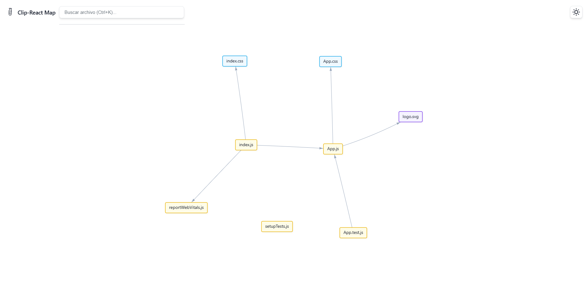

# Clip-React


**Clip-React is a command-line tool for generating visual and interactive maps of dependencies in React projects.**

This utility allows you to understand the architecture of your applications, identify key components, and debug complex relationships in a simple and graphical way.



## Main Features

* **Dependency Analysis**: Scans your project to find all files and their import relationships.
* **Interactive Map**: Generates an HTML file with an interactive graph to visualize the connections between components and modules.
* **Automatic Directory Detection**: Automatically identifies common directories in React projects such as `src/`, `app/`, `components/`, and more.
* **Detailed Visualization**:
  * **Color coding** to differentiate file types (JavaScript, TypeScript, CSS, etc.).
  * **Integrated search** (`Ctrl+K`) to quickly locate files.
  * **Information panel** that shows file size, number of dependencies, and the files that use it.
  * **Intuitive navigation** with zoom and drag.

## Installation

To install Clip-React globally on your system, run the following command:

```bash
npm install -g clip-react
```

## Usage

To analyze a project, navigate to the root directory and run:

```bash
clip-react map
```

An interactive menu will start, allowing you to select the directory you want to analyze.

## Command Options

| Option          | Alias | Description                                       |
| --------------- | ----- | ------------------------------------------------- |
| `map`          | `map` | Generates a map.                                 |
| `--help`       | `-h`  | Displays the command help.                        |
| `--version`    | `-v`  | Displays the installed version.                   |

## Contributions

Due to the CC BY-NC-ND 4.0 license restrictions, contributions to this project are not permitted. This license specifically prohibits modifications and derivative works. We appreciate your interest, but the code must remain in its original form.

## License
This project is licensed under the [Creative Commons Attribution-NonCommercial-NoDerivatives 4.0 International](https://creativecommons.org/licenses/by-nc-nd/4.0/).
